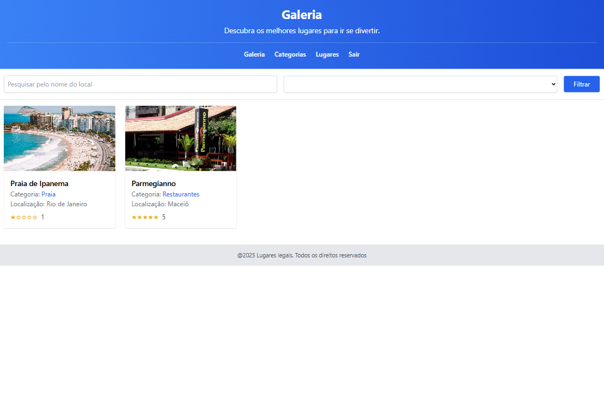

# PasseioApp



Baixe [aqui](./public/demo.mp4) um vídeo curto demonstrando a aplicação.

Desenvolvido para realizar estudos sobre angular com modularização (no-standalone).

Esse projeto foi desenvolvido utilizando [Angular CLI](https://github.com/angular/angular-cli) na versão 19.2.8.

This project was generated using [Angular CLI](https://github.com/angular/angular-cli) version 19.2.8.

```bash
npm run server
```

## Sobre

Utiliza tailwind css

Simula o banco de dados com json na pasta api e sobe com json-server

Login com google: Google cloud console (OAuth2)

Docker images e containers

## Docker

```bash
ng build
```

Imagens:

### API

```bash
cd api
docker build --tag cursoangular-api .
```

- [cursoangular-api](./api/Dockerfile): Utiliza os arquivos json na porta 4000 com **json-server** (back)

cursoangular-api-container: docker run -p 4000:4000 --name cursoangular-api-container -d cursoangular-api

### APP

```bash
docker build --tag cursoangular-app .
```

- [cursoangular-app](./Dockerfile): Utiliza a pasta **dist/passeio-app/browser** com **NGINX** no **Docker** (front)

cursoangular-app-container: docker run -p 4200:80 --name cursoangular-app-container -d cursoangular-app

## Ambiente 

### Desenvolvimento

Para poder abrir a aplicação localmente é necessário utilizar o comando: 

```bash
ng serve
```

```bash
npm run server
```

Uma vez que o servidor esteja rodando é possível acessar a interface web no link `http://localhost:4200/`. A aplicação irá atualizar automaticamente caso haja alguma alteração nos arquivos.

Assim como, é possível acessar os dados salvos no link `http://localhost:3000/`.

### Produção

Para poder abrir a aplicação simulando o ambiente de produção é necessário utilizar o comando: 

```bash
ng serve --configuration=production
```

```bash
npm run server
```

Uma vez que o servidor esteja rodando é possível acessar a interface web no link `http://localhost:4200/`. A aplicação irá atualizar automaticamente caso haja alguma alteração nos arquivos.

Assim como, é possível acessar os dados salvos no link `http://localhost:4000/`.

## Módulos

1. Categoria
2. Lugares

### Ideias de evolução do app

1. Validação de campos otimizada
2. Conexão com banco de dados
